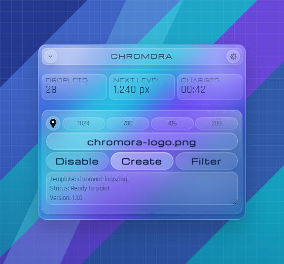
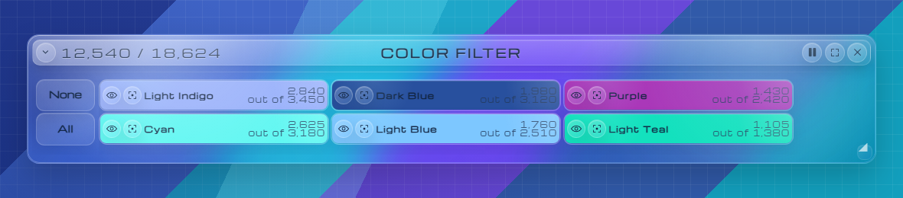
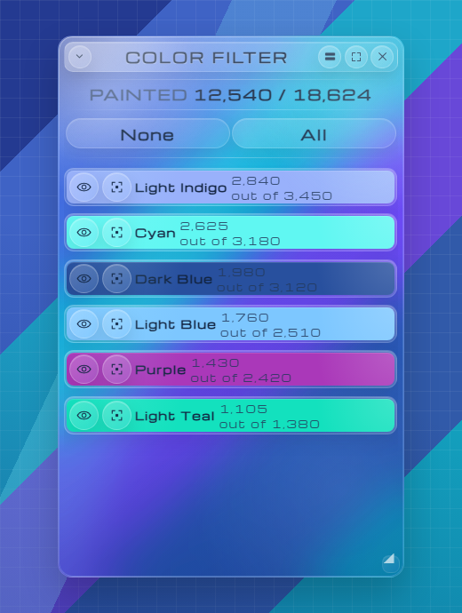
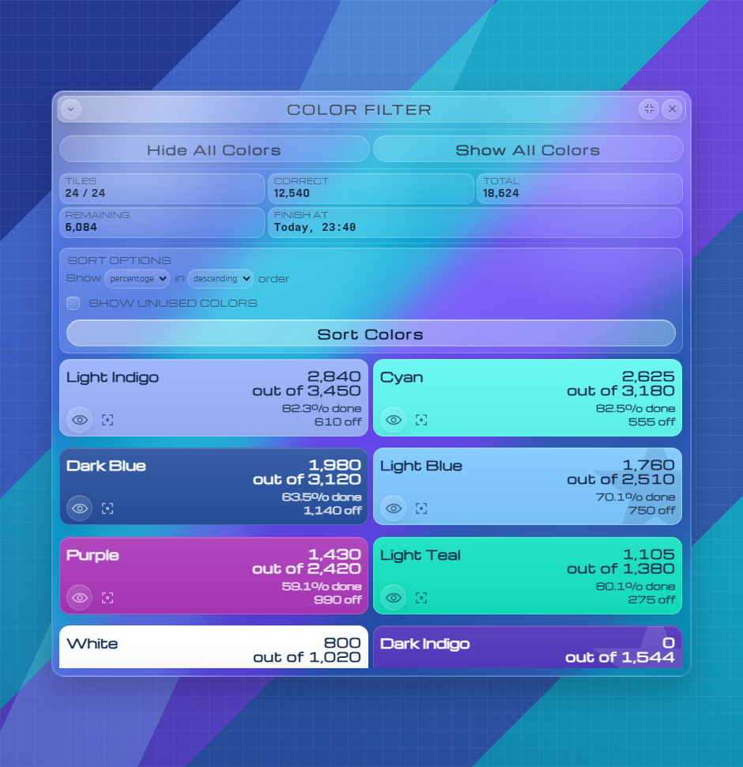
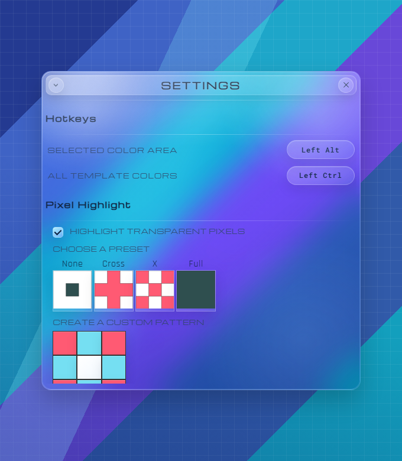

# Chromora

Chromora is a feature-focused fork of [Blue Marble](https://github.com/SwingTheVine/Wplace-BlueMarble) for [wplace.live](https://wplace.live/).

The project started with Blue Marble, then grew into a separate toolkit for checking artwork, finding unfinished areas, and preparing pixels faster.

## Features

### Smooth interface

- New Y2K look across every window.
- Windows open, close, minimize, expand, and change shape smoothly.
- Large templates stay responsive while Chromora works in the background.
- Windows remember where you placed them and how large they were.

### Color Filter

- Switch between horizontal, vertical, and fullscreen views.
- Horizontal and vertical views remember their own positions.
- Hide colors you do not need and arrange the list your way.
- See how many pixels each color needs, how many are already correct, and how much work remains.
- A loader stays visible until the color information is actually ready.

### Find unfinished areas

- Pick a color and immediately see pixels painted with the wrong color.
- Show empty pixels that still need the selected color.
- Mark unfinished areas with clean outlines, without crosses or broken corners.
- Keep highlighted zones even and consistent across the whole artwork.
- Work with large artworks without the regular freezes older versions had.

### Prepare an area for painting

- Hold `Left Alt` and drag to add empty pixels that use your currently selected Wplace color.
- Hold `Left Ctrl` and drag to add every empty pixel in the area using its color from the template.
- Check the result, then press Wplace's **Paint** button yourself.
- Pixels erased from the draft can be selected and added again.
- If the whole area needs more droplets than you have, Chromora fills as much as possible from left to right.
- A warning appears only when no droplets are available at all.
- Change either hotkey in Settings whenever you need.

## Screenshots

### Main window

Upload a template, set its coordinates, check your droplets, and open the Color Filter from one compact window.

### Color Filter: horizontal

Scan many colors while keeping the filter close to the edge of the canvas.

### Color Filter: vertical

Keep a compact color checklist open beside your artwork.

### Color Filter: fullscreen

See overall progress, sort colors, and compare every color's remaining pixels in one view.

### Settings

Set area-selection hotkeys and choose how unfinished pixels are highlighted.

## Installation

Install the latest userscript release:

[Download latest release](https://github.com/alexeygasenko/Chromora/releases/latest)

Use `Chromora.user.js` with a userscript manager such as Tampermonkey, then refresh [wplace.live](https://wplace.live/).

## Fork and upstream

Chromora is based on [SwingTheVine/Wplace-BlueMarble](https://github.com/SwingTheVine/Wplace-BlueMarble). Original architecture, license notices, and contributor credits remain preserved.

Chromora is maintained independently and is not an official Blue Marble or Wplace project.

## License

Chromora is distributed under the Mozilla Public License 2.0 inherited from Blue Marble. See [LICENSE.txt](./LICENSE.txt).
