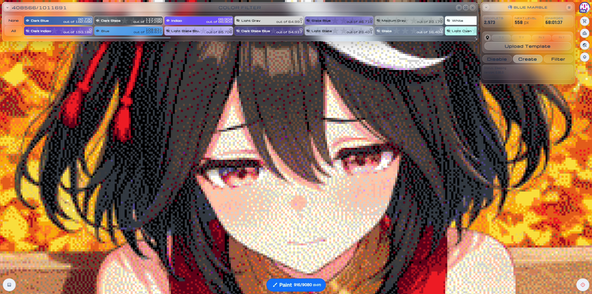
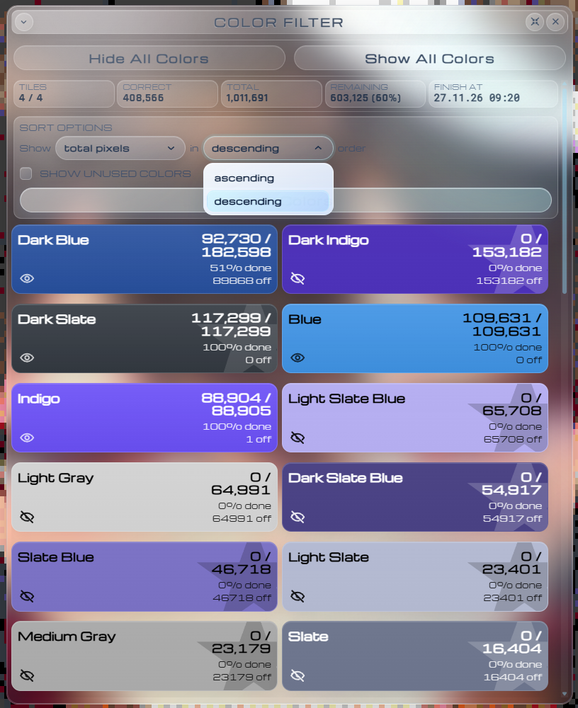

# Chromora

Chromora is a feature-focused fork of [Blue Marble](https://github.com/SwingTheVine/Wplace-BlueMarble) for [wplace.live](https://wplace.live/).

The project still uses Blue Marble's template engine, storage format, and MPL-2.0 foundation, but its interface and workflow have evolved into a separate liquid-glass toolkit for inspecting, highlighting, and preparing pixel art.

## Features

### Fluid interface

- Y2K liquid-glass design across the main window, Color Filter, and Settings.
- Fluid minimize, expand, fullscreen, layout-switch, and close animations.
- Responsive motion designed to avoid layout thrashing and long main-thread stalls.
- Movable and resizable tools with persisted positions and dimensions.

### Color Filter

- Horizontal, vertical, and fullscreen layouts.
- Independent saved positions for horizontal and vertical windows.
- Persistent color visibility and custom sorting.
- Live per-color totals, correct-pixel counts, and completion progress.
- Animated loading states that remain active until tile statistics are ready.

### Pixel inspection

- Immediate highlighting of incorrectly painted pixels for a selected color.
- Immediate highlighting of transparent pixels that still require the selected color.
- Lightweight merged-zone outlines without crosses at tile intersections.
- Stable 16x16 zone geometry across template chunks and map tiles.
- Chunked rendering and browser yielding to reduce freezes on large templates.

### Area drafting

- Hold a configurable hotkey (`Left Alt` by default) and drag over the map to select an area.
- Adds only transparent template pixels that require the currently selected Wplace color.
- Prepares pixels in the Wplace draft; the user still presses Wplace's **Paint** button manually.
- Deduplicates pixels already added by previous selections.
- Rejects the entire selection when it exceeds available paint charges; no partial draft is created.
- Liquid-glass loader, success state, and limit alerts.

### Compatibility

- Existing `bmTemplates` and `bmUserSettings` storage remains supported.
- Blue Marble and Chromora template JSON files can both be imported.
- Legacy `BlueMarble*.user.js` artifact names remain for update compatibility.

## Screenshots

Horizontal layout for fast scanning across large color sets.

Vertical layout for a compact persistent tool window.

Fullscreen layout with larger cards and richer statistics.

## Installation

Install the latest userscript release:

[Download latest release](https://github.com/alexeygasenko/Chromora/releases/latest)

Use `BlueMarble.user.js` with a userscript manager such as Tampermonkey, then refresh [wplace.live](https://wplace.live/). The filename is retained for compatibility; the installed userscript is named **Chromora**.

## Fork and upstream

Chromora is based on [SwingTheVine/Wplace-BlueMarble](https://github.com/SwingTheVine/Wplace-BlueMarble). Original architecture, license notices, and contributor credits remain preserved.

Chromora is maintained independently and is not an official Blue Marble or Wplace project.

## License

Chromora is distributed under the Mozilla Public License 2.0 inherited from Blue Marble. See [LICENSE.txt](./LICENSE.txt).
