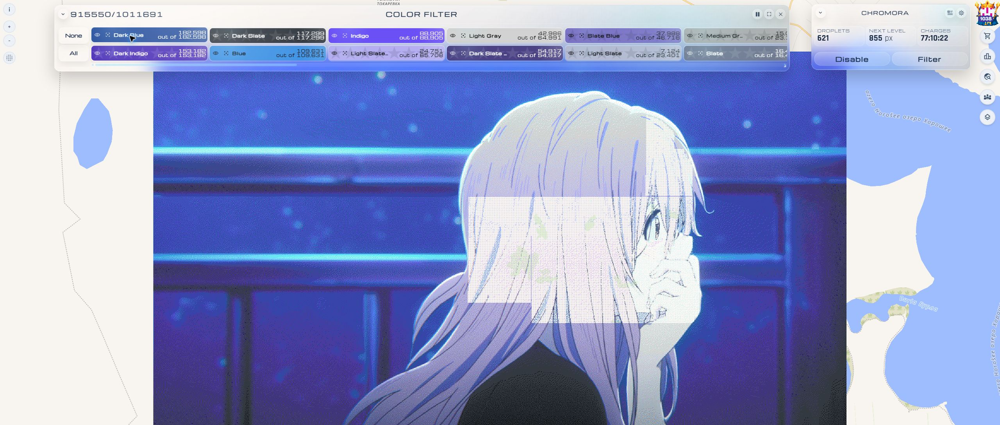
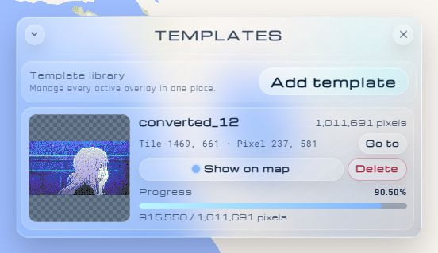
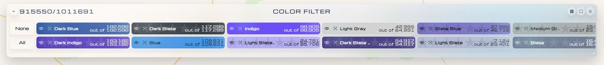

# Chromora

### Your next pixel, made clearer.

Bring your artwork to [Wplace](https://wplace.live/), see what still needs painting, and turn a small patch of the map into your next paint draft. Chromora keeps your templates, colors, and progress close at hand — with a little early-2000s optimism.

[Get Chromora](#installation) · [Explore the website](https://alexeygasenko.github.io/Chromora/) · [Visual guide](./docs/FEATURES.md) · [Releases](https://github.com/alexeygasenko/Chromora/releases)

## Installation

1. Install a userscript manager such as [Tampermonkey](https://www.tampermonkey.net/) in your browser.
2. Open the [latest Chromora release](https://github.com/alexeygasenko/Chromora/releases/latest), choose `Chromora.user.js`, and confirm installation in your userscript manager.
3. Refresh [wplace.live](https://wplace.live/). Open **Templates** in the Chromora title bar to add your first image.

Working from this repository? The ready-to-install file is [`dist/Chromora.user.js`](./dist/Chromora.user.js). Open its raw contents or copy them into your userscript manager, save, and refresh Wplace.

This guide covers **Chromora 1.4.0**.

## Features

- **Keep your artwork together.** Save several templates, jump to them, and track each one separately.
- **Find the next thing to paint.** Filter colors, spot wrong pixels, and outline empty areas.
- **Prepare a draft with a drag.** Choose one color or all template colors, review the result, then press **Paint** yourself.
- **Make the map feel like yours.** Pick Glass, Light, Dark, or Frutiger Aero, then arrange the windows around your artwork.

## Screenshots

The screenshots below were captured on Wplace in a real browser, using the **Glass** theme.

### A home for every template

Open **Templates** to add an image without replacing your existing work. Each card gives you a preview, coordinates, progress, and a **Go to** shortcut. Turn **Show on map** off to pause a template while keeping it in your library.

Choose your image's **top-left pixel** on the map. The coordinate picker fills **Tile X / Y** and **Pixel X / Y** for you; **Use last map click** recalls your latest selection. You can also type the numbers or paste all four coordinates into one field. Check the position, then press **Create**.

### Less searching, more painting

**Color Filter** shows what is done and what remains. Hide colors with the eye buttons, use **None / All** for the whole list, and switch between a slim horizontal strip, a vertical list, or a roomy fullscreen view.

Use a color's highlight button to cycle through **wrong pixels → empty areas → off**. Missing areas get clear outlines, so the next patch of work is easy to find.

[Explore filter layouts, sorting, and highlights →](./docs/FEATURES.md#find-your-next-pixels)

### Drag an area. Check the draft. Paint.

| What you want to prepare | Default shortcut |
| --- | --- |
| Empty pixels that match the selected Wplace color | Hold **Left Alt** and drag |
| Empty pixels using every color in your template | Hold **Left Ctrl** and drag |

You can also use the two area buttons on the right side of the map. Chromora adds pixels to Wplace's draft within your available **charges**. Review or clear the draft, then press Wplace's **Paint** button when you are ready.

*The all-colors area button is highlighted, ready for a drag.*

Prefer different keys? Change either shortcut in **Settings → Hotkeys**. [Explore both drafting modes and shortcuts →](./docs/FEATURES.md#prepare-a-paint-draft)

### A brighter place to create

Choose **Glass**, **Light**, **Dark**, or **Frutiger Aero** in **Settings → Appearance**. Frutiger Aero brings sky-blue glass, glossy controls, fresh green accents, and its own Exo 2 and PT Sans fonts. Your choice stays with you after a reload; the screenshot below shows Glass.

[Explore themes and window controls →](./docs/FEATURES.md#make-it-your-space)

## Explore more

The [illustrated guide](./docs/FEATURES.md) covers the main window, overlay toggle, template progress and deletion, all Color Filter layouts, custom highlights, shortcuts, and recovery tools.

Found something that needs work? [Report a bug or suggest a feature](https://github.com/alexeygasenko/Chromora/issues). For project details, see [the documentation](./docs/README.md), [contributing](./docs/CONTRIBUTING.md), and [security](./docs/SECURITY.md).

## Built on Blue Marble

Chromora is an independent fork of [Blue Marble by SwingTheVine](https://github.com/SwingTheVine/Wplace-BlueMarble). The original architecture, license notices, and [contributor credits](./docs/CREDITS.md) are preserved.

Chromora is not an official Blue Marble or Wplace project and is not affiliated with a userscript manager. It is distributed under the **Mozilla Public License 2.0**; see [LICENSE.txt](./LICENSE.txt).
