# A small guide to a more colorful map

[Install Chromora](../README.md#installation) · [Project home](../README.md) · [Website](https://alexeygasenko.github.io/Chromora/)

Add your artwork, find an unfinished patch, and prepare your next draft. This guide walks through the controls in **Chromora 1.4.0**.

Every screenshot in this guide was captured on Wplace in a real browser, with the **Glass** theme selected.

## Start with the main window

The main window keeps your droplets, next-level progress, and charge-refill timer together. The title-bar shortcuts open **Templates** and **Settings**; **Filter** opens your color checklist.

Keep just the title bar

Click the small arrow to minimize the window. Your template and settings shortcuts stay within reach; click the arrow again to expand it.

See the map without your overlays

Click **Disable** to hide template overlays together. The button changes to **Enable**, which brings them back. Your saved templates stay in the library.

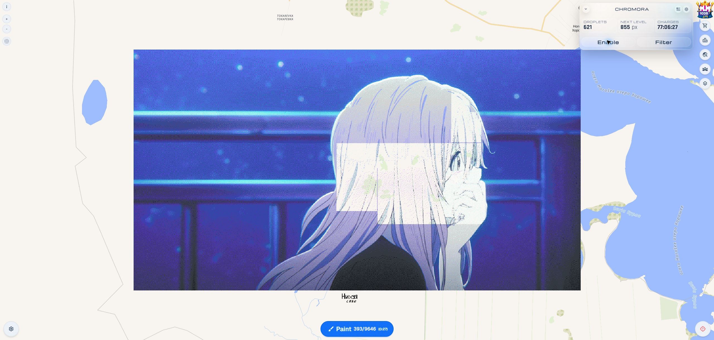

## Keep your artwork together

Open **Templates** from the main title bar. **Add template** lets you choose an image without replacing the artwork already in your library.

**Go to** centers the map on an image. Turn **Show on map** off to pause one template: it stays saved, but no longer contributes to the overlays, area drafts, or Color Filter totals.

### Place it where you want it

After choosing a file, click the map pixel where the image's **top-left corner** belongs. The picker fills all four fields. **Use last map click** loads the most recent selection again.

You can also enter the numbers yourself, or paste four coordinates into any field in this order: **Tile X, Tile Y, Pixel X, Pixel Y**. Check the fields, then click **Create**. **Cancel** or **Escape** takes you back without adding the image.

Follow each template's progress

Each card tracks its own artwork. Keep several projects in the library, leave the one you want visible, and check its progress before jumping back to the map.

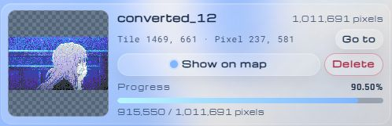

Remove a template

Use the card's delete control. A confirmation appears inside that same card, so you can check the name before choosing **Delete** or **Cancel**.

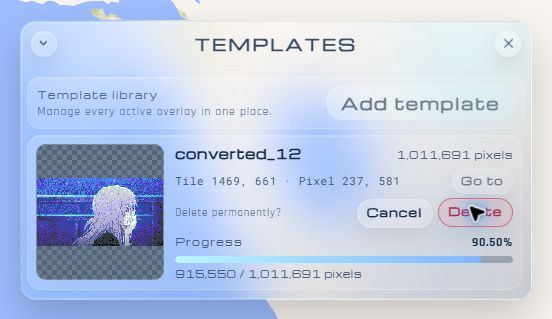

## Find your next pixels

Open **Filter** from the main window. The eye button shows or hides a color in the overlay. **None / All** control the whole list; hiding a color does not delete it from your image.

### A strip, a list, or the whole picture

The **horizontal** layout gives you a shallow row of colors and counts, leaving most of the map in view.

The **vertical** layout works as a compact checklist beside the artwork.

Switch layouts with the title-bar layout button. Drag the bottom-right grip to resize the window; the two compact layouts remember their own positions and sizes.

Expand the window for **fullscreen** statistics: loaded tiles, correct pixels, remaining pixels, and a rough finish estimate. The estimate assumes one remaining pixel every 30 seconds; it is a reference, not a promise about your painting speed.

Put the most useful colors first

Sort by name, color ID, premium status, completion percentage, or pixel counts. Choose ascending or descending order, optionally include unused colors, then press **Sort Colors**. Sorting by **incorrect pixels → descending** brings the biggest unfinished colors to the top.

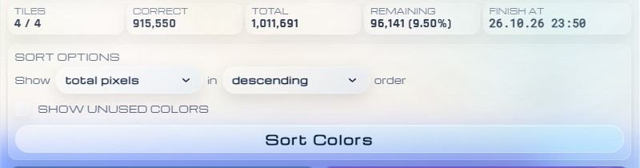

### Find mistakes and empty areas

A color's highlight button cycles through three states:

1. **Wrong pixels:** mark painted pixels that do not match the selected template color.
2. **Empty areas:** outline unpainted areas that need that color.
3. **Off:** return to the usual overlay.

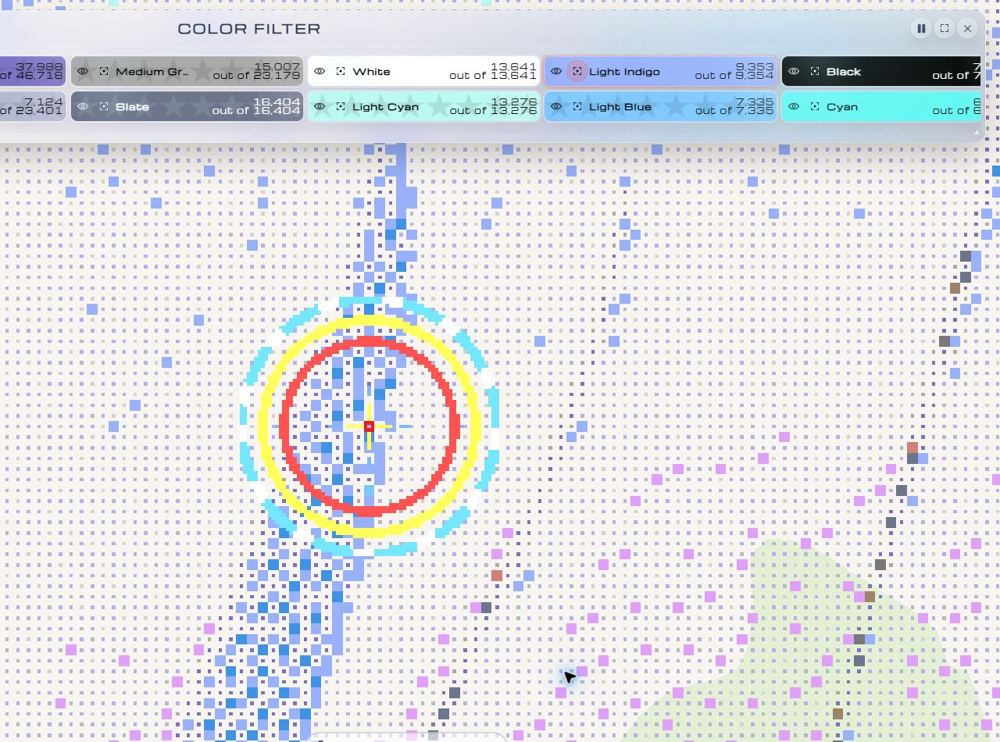

*The rings mark a painted pixel that should be Light Indigo.*

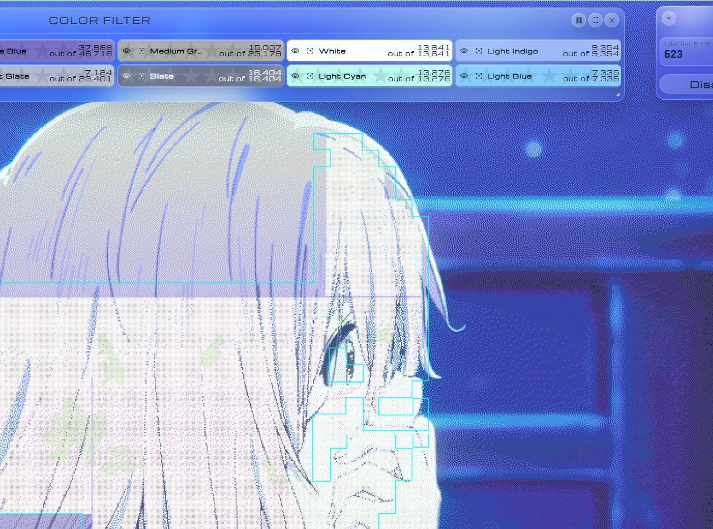

*In missing-pixel mode, cyan outlines mark empty areas that need the selected color.*

Choose your own highlight pattern

In **Settings → Pixel Highlight**, pick **None**, **Cross**, **X**, or **Full**. For a custom pattern, click cells in the **3 × 3** grid to cycle between disabled, incorrect-pixel, and template-color states. **Highlight transparent pixels** controls whether empty map pixels participate in the general highlight pattern.

The **Templates** options below choose whether new templates skip fully transparent tiles, with a separate experimental option for more aggressive skipping.

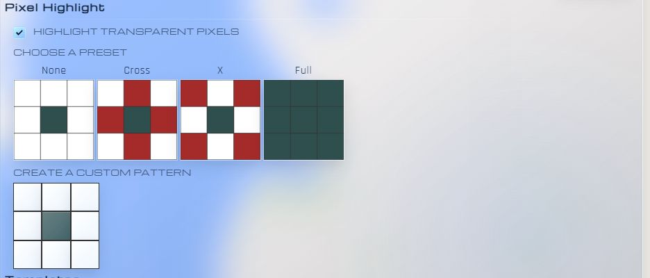

## Prepare a paint draft

Open Wplace's paint controls. The two area buttons appear on the right side of the map: one for the selected color, one for all template colors. Activate a button and drag a rectangle, or hold its shortcut while dragging.

### One color at a time

Select a color in Wplace, then hold **Left Alt** and drag. Chromora adds empty pixels whose template color matches your selection.

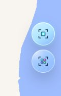

*The upper button selects an area in your current color.*

### Every template color

Hold **Left Ctrl** and drag to prepare empty pixels in all their template colors.

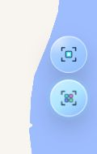

*The lower button selects an area using all template colors.*

Both modes use your available **charges**, taking the existing draft into account. If the whole area will not fit, only the available amount is added. Review the draft, clear or adjust it if needed, then click Wplace's **Paint** yourself.

Use keys that suit you

In **Settings → Hotkeys**, click a shortcut and press the key you want to use. Press **Escape** to cancel a key change.

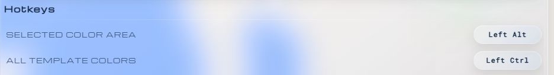

## Make it your space

Move windows by their title bars, minimize them when you need more map space, and use Color Filter's resize grip and layout controls to fit the task. The saved theme and supported window positions return after a reload.

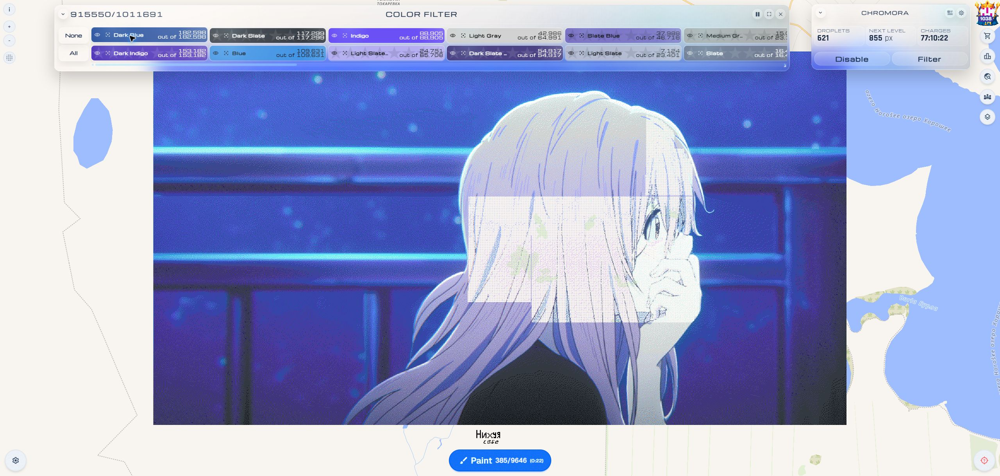

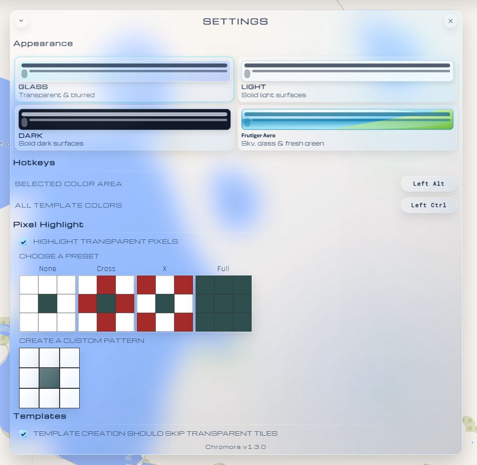

### Frutiger Aero

Sky-blue glass, glossy buttons, green accents, and an early-2000s feel. This theme has its own **Exo 2** and **PT Sans** fonts, bundled with the userscript.

### Glass, Light, and Dark

**Glass** keeps the map visible through blurred, translucent surfaces. **Light** uses solid light surfaces, while **Dark** uses solid dark surfaces.

Choose a theme in **Settings → Appearance**. It applies immediately across Chromora's windows and area-selection controls.

## Recover older templates

If an older storage format needs attention, the **Template Wizard** explains the problem and lists the templates it finds. It offers a download of the templates and an update to the current storage format.

Chromora is an independent fork of [Blue Marble](https://github.com/SwingTheVine/Wplace-BlueMarble), released under the [Mozilla Public License 2.0](../LICENSE.txt). It preserves the upstream [credits](./CREDITS.md) and is not an official Wplace or Blue Marble project.
